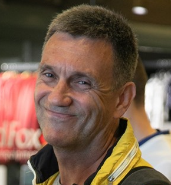

# И кто-это к нам пришёл? :)

Меня зовут **Андрей Лобанов** и я пытаюсь стать программистом.
Раньше я занимался этим при решении разных прикладных задач и при  проведении исследований.
Годков-то мне уже прилично прилетело, поэтому я буду винтажным Джуном :)

На разных этапах я программировал на различных языках:
- PL/1
- Fortran
- Basic
- Pascal
- Delphi
- php

А сейчас учусь разработке мобильных приложений.

Связаться со мной можно по email <andrey922@gmail.com> или позвонив по телефону [+7 911 739-89-17](tel:+79117398917)

